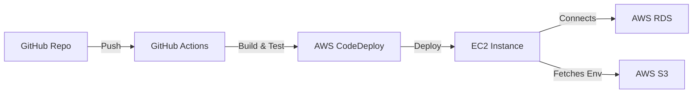

# **🚀 Full-Stack E-Commerce App (Next.js + Laravel) | CI/CD with AWS CodeDeploy | Nginx + PM2 on AWS EC2**  

##**A modern, scalable, and secure full-stack application** built with **Next.js (Frontend)** and **Laravel (Backend)**, deployed on **AWS EC2** via **GitHub Actions (CI/CD)**. This project demonstrates **DevOps best practices**, including **secure environment management, automated deployments, and cloud infrastructure optimization**.  

---

## **🔹 Key Features**  
✅ **Full-Stack Architecture** – Next.js (React) frontend + Laravel (PHP) backend in a **monorepo**.  
✅ **Automated CI/CD Pipeline** – GitHub Actions builds, tests, and deploys to AWS CodeDeploy.  
✅ **Secure Secrets Management** – Environment variables stored in **AWS S3** (retrieved during build).  
✅ **AWS Cloud Integration** – EC2, RDS (MySQL), IAM Roles, and S3 for storage.  
✅ **Infrastructure as Code (IaC)** – AWS resources provisioned with best-practice permissions.  
✅ **Scalable & Cost-Optimized** – Load-balanced EC2 instances with auto-scaling (future-ready).  

---

## **🛠 Tech Stack**  
| **Category**       | **Technology**                          |
|--------------------|----------------------------------------|
| **Frontend**       | Next.js (TypeScript, Tailwind CSS)     |
| **Backend**        | Laravel (PHP)                          |
| **Database**       | AWS RDS (MySQL)                   |
| **CI/CD**          | GitHub Actions → AWS CodeDeploy        |
| **Infrastructure** | AWS EC2, S3, IAM, CloudWatch           |
| **Secrets Mgmt**   | AWS S3 (env files)                     |

---

## **📦 Deployment Architecture**  


1. **GitHub Actions** triggers on `main` branch push.  
2. **Builds Next.js frontend** and **packages Laravel backend**.  
3. **Deploys artifacts** to AWS CodeDeploy.  
4. **CodeDeploy installs app** on EC2 (with hooks for migrations/optimization).  
5. **Frontend fetches backend URL** securely from S3 env during build.  

---

## **🔐 Security & Best Practices**  
- **IAM Roles** – Least-privilege permissions for CodeDeploy/EC2.  
- **S3 Environment Storage** – `.env` files securely fetched (not hardcoded).  
- **HTTPS & Database Encryption** – RDS uses SSL, frontend enforces secure connections.  
- **Automated Backups** – AWS RDS snapshots enabled.  

---

## **🚀 Getting Started (Local Dev Setup)**  
### **Prerequisites**  
- Node.js ≥18, PHP ≥8.1, Composer  
- AWS CLI configured (`aws configure`)  

### **Installation**  
```bash
# Clone repo
git clone https://github.com/iam-ismaeel/Automatic-fullstack-app-deployment-.git
cd Automatic-fullstack-app-deployment-

# Install frontend deps
cd frontend && yarn install

# Install backend deps
cd ../backend && composer install

# Copy .env.example to .env and configure
cp .env.example .env
php artisan key:generate
```

### **Running Locally**  
```bash
# Frontend (Next.js)
cd frontend && yarn dev

# Backend (Laravel)
cd backend && php artisan serve
```
Access:  
- Frontend: `http://localhost:3000`  
- Backend: `http://localhost:8000`  

---

## **⚙️ CI/CD Pipeline (GitHub Actions)**  
The workflow:  
1. **Lints and tests** frontend/backend.  
2. **Builds production-optimized** Next.js app.  
3. **Uploads artifacts** to S3.  
4. **Triggers CodeDeploy** to EC2.  

**View freontend workflow file**: [`.github/workflows/deploy.yml`](.github/workflows/frontend.yaml)  
**View backend workflow file**: [`.github/workflows/deploy.yml`](.github/workflows/backend.yaml) 
---

## **📈 Monitoring & Scaling (Future Improvements)**  
- **AWS CloudWatch** – Logs and performance metrics.  
- **Auto-Scaling Group** – For traffic spikes.  
- **CDN (CloudFront)** – Faster global frontend delivery.  

---

## **💡 Why This Project Stands Out**  
✔ **End-to-End DevOps Automation** – From code push to live deployment.  
✔ **Production-Grade Security** – Secrets in S3, IAM roles, encrypted RDS.  
✔ **Scalable AWS Architecture** – Ready for high availability.  
✔ **Modern Full-Stack Practices** – Next.js SSR + Laravel API.  

---
## 🖼️ Screenshots

| Frontend-app | CodeDeploy |
|----------|-----------|
|  |  |
---
## **📜 License**  
MIT © [Kasali Ismail Olamilekan] 
---


